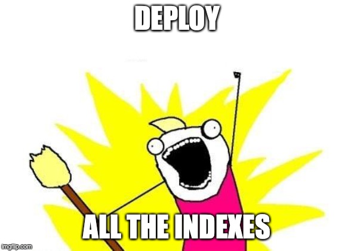

class: center, middle, blue

# ACM and Elasticsearch

---

# Elasticsearch and ACM

* Automated Configuration Management
--

* Database Configuration
--

* Leverages SQL **and** PeopleCode
--

* Search Framework Plugins
--

* Configure **and** Deploy Search Indexes

---

class: center, middle, white

# Demo



???

### Pre-Demo

1. Verify ES is running

    ```bash
    sudo -i -u esadm1
    cd /opt/oracle/psft/pt/ES/elasticsearch7.0.0
    export JAVA_HOME=/opt/oracle/psft/pt/ES/es_jre1.8.0_251
    nohup bin/elasticsearch &
    cd ../Kibana7.0.0
    nohup bin/kibana &
    ```

### Demo

**Goals for Demo**

1. Configure ES Cluster
1. Clear previous ES Deployment Data
1. Redeploy ALL indexes

**ACM and Search Framework Demo**

1. Log into the PIA
1. Open the `SEARCH_TEMPLATE` ACM Template
1. Configure the template variables
  1. Use `psvagabond` for the host
  1. Don't use the `@domain@` value if using Vagabond
1. Configure an ES node 
  1. Make sure to use `PSFT_DEFAULT` for the Search Instance
1. Show how you can configure a cluster
1. Remove previously deployed PTSF data

    This removes it from the PSTF* tables, but not Elasticsearch

1. Deploy ALL indexes and start a full build for each
1. Show the run controls for the builds (full and incr)

---

# Elasticsearch Refresh Process

1. Configure ACM template 
  * `DBNAME_CONFIG`
  * `DBNAME_REFRESH`

???
The ACM template should be just for refreshing. Include the SES Cleanup plugin, Search Instance Config, and then the Deploy Search Definitions. I like to use `DBNAME_REFRESH` for the template name (make sure you add security), and you can include other refresh-based ACM plugins (IB config, custom like email scrambling)
--
1. Execute ACM 
  * Command Line App Engine Call
  * Insert into Process Monitor
  * Deployment Package(*)
???
There are a couple of ways you can execute ACM templates.
1. ACM is just an App Engine, so you can use the command line. Easy to schedule via cron/Scheduled Tasks. There is even helper script to make the call easier.
1. Another method is to use SQL to create a process scheduler request during refresh. Then ACM will run when you boot your scheduler. Offloads the AE to your scheduler as well.
1. The last method is via DPK. This is different than the rest. DPK doesn't use the templates in the database; it uses configuration defined in your `psft_customizations.yaml` file. Useful if you have ACM already set up to run with DPK or you want store ACM configuration outside the database. It's a useful way to leverage all of the config data you already have in Hiera.